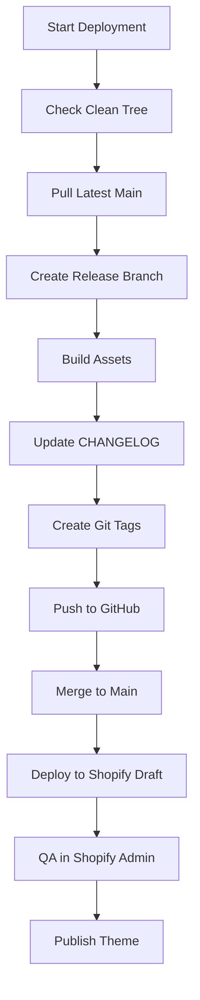

# 🚀 AXOLOP Deployment Guide

## Quick Start

### Full Deployment (with version control)
```bash
./scripts/deploy.sh v1.3.0 "Analyzer hero copy + comparison table perf"
```

### Quick Deployment (auto-increment patch)
```bash
./scripts/quick-deploy.sh "Fixed mobile CTA button styling"
```

## 📋 What the Deployment Script Does

### 1. **Git Backup & Versioning**
- Creates dated backup tag: `backup/YYYY-MM-DD-vX.Y.Z`
- Creates semantic version tag: `vX.Y.Z`
- Updates CHANGELOG.md with release notes

### 2. **GitHub Push**
- Pushes release branch: `release/vX.Y.Z`
- Pushes version tag: `vX.Y.Z`
- Pushes backup tag: `backup/YYYY-MM-DD-vX.Y.Z`
- Merges to main branch

### 3. **Shopify Deployment**
- Validates theme structure
- Pushes as **draft theme** (unpublished)
- Provides QA instructions

## 🎯 Deployment Workflow



## 🔧 Manual Steps After Deployment

### 1. **QA the Draft Theme**
- Go to Shopify Admin → Online Store → Themes
- Find your draft theme (named with version)
- Test key pages:
  - `/pages/analyzer` (main conversion funnel)
  - Cart functionality, mobile responsiveness
  - Speed (LCP < 1.0s)

### 2. **Publish the Theme**
- In Shopify Admin → Online Store → Themes → Actions → **Publish**
- Or use CLI: `shopify theme publish [THEME_ID]`

### 3. **Post-Publish Cleanup**
```bash
# Export settings snapshot
git add config/settings_data.json
git commit -m "chore: snapshot settings post-publish $VERSION"
git push origin main
```

## 🚨 Rollback Strategy

If something breaks, rollback to the last good version:

```bash
# Rollback to specific version
git checkout -b rollback/v1.2.3 tags/v1.2.3
shopify theme push --unpublished --path . --message "rollback: v1.2.3"
# Then publish the rollback theme from Shopify Admin
```

## 📊 Version Naming

- **Major** (v2.0.0): Breaking changes, new features
- **Minor** (v1.3.0): New features, sections, improvements  
- **Patch** (v1.2.1): Bug fixes, copy updates, styling tweaks

## 🔍 Pre-Deploy Checklist

- [ ] Working tree is clean
- [ ] All changes committed
- [ ] Assets built (if using build process)
- [ ] Theme validates without errors
- [ ] CHANGELOG updated
- [ ] Version number follows semantic versioning

## 🧪 QA Checklist

- [ ] **Functional**: Trial flow, cart, checkout work
- [ ] **CRO**: CTAs visible, comparison table scrolls on mobile
- [ ] **Performance**: No console errors, fast loading
- [ ] **SEO**: Unique titles, meta descriptions, alt text
- [ ] **Accessibility**: Keyboard navigation, focus states

## 🛠️ Troubleshooting

### Shopify CLI Issues
```bash
# Re-authenticate
shopify auth logout
shopify auth login

# Check store connection
shopify theme list
```

### Git Issues
```bash
# Check remote configuration
git remote -v

# Verify SSH key
ssh -T git@github.com
```

### Build Issues
```bash
# Clean and rebuild
rm -rf node_modules package-lock.json
npm install
npm run build
```

## 📝 Examples

### New Feature Release
```bash
./scripts/deploy.sh v1.4.0 "Added TikTok video section + improved mobile nav"
```

### Bug Fix Release  
```bash
./scripts/quick-deploy.sh "Fixed sticky CTA overlap on mobile"
```

### Hotfix Release
```bash
./scripts/quick-deploy.sh "Emergency fix: cart drawer not opening"
```

---

**Remember**: Always QA the draft theme before publishing! 🎯
